# Figuras de navegación astronómica

Aplicación web para dibujar las figuras de un libro o una clase de navegación por el Sol y las
estrellas: coordenadas terrestres y celestes, triángulo de posición, movimiento diurno, recta de
altura y más. Se eligen los valores en grados y minutos y la figura se dibuja con geometría real,
lista para descargar en PNG o SVG, paso a paso o como vídeo.

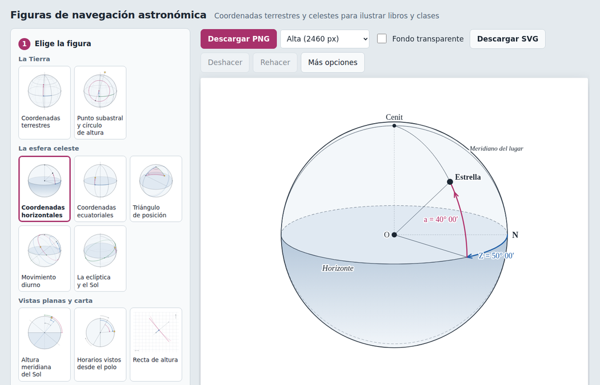

## Figuras

| | | |
| --- | --- | --- |
| 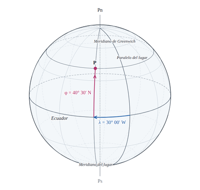 Coordenadas terrestres | 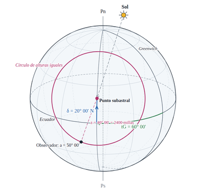 Punto subastral y círculo de altura | 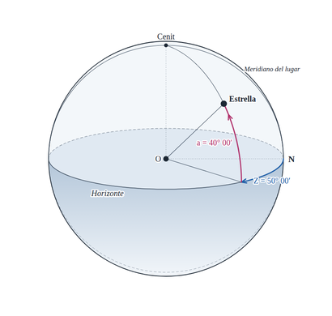 Coordenadas horizontales |
| 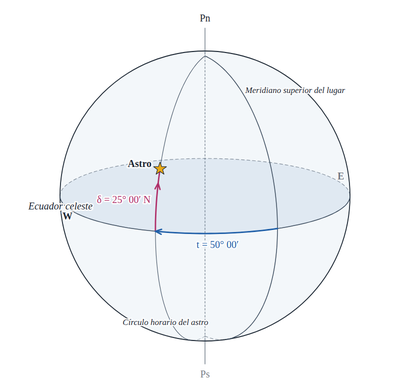 Coordenadas ecuatoriales | 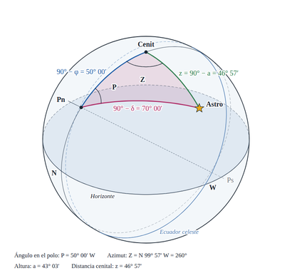 Triángulo de posición | 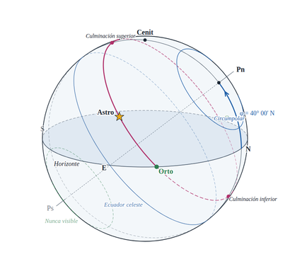 Movimiento diurno |
| 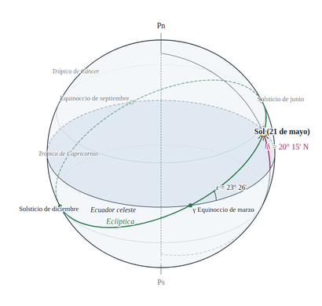 La eclíptica y el Sol | 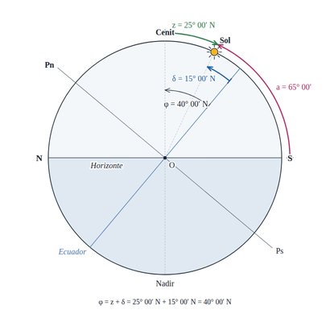 Altura meridiana del Sol | 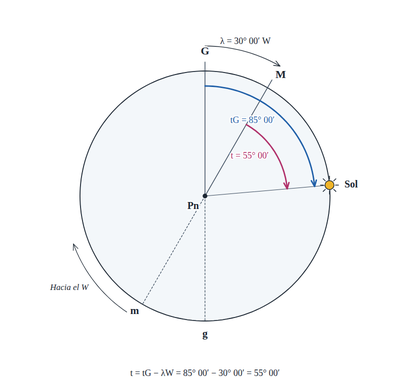 Horarios vistos desde el polo |
| 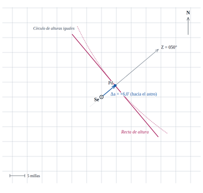 Recta de altura | 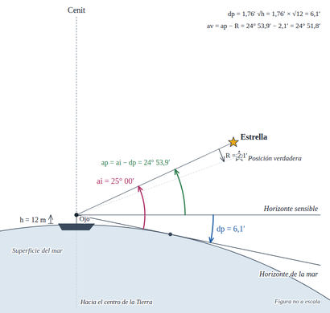 Depresión del horizonte | |

## Qué se puede hacer

- Ajustar cada valor en grados y minutos (con hemisferio) o con un deslizador.
- Elegir qué se ve, mover los rótulos con el ratón, cambiar su texto y girar la esfera.
- Color o blanco y negro, notación internacional (φ, λ, δ, t) o española (l, L, d, hL), rótulos
  con símbolos o con palabras, que pueden seguir las curvas.
- Ver la figura **paso a paso** y descargar todos los pasos en un ZIP de imágenes.
- **Animar**: construir la figura, girar la esfera o cambiar un valor (por ejemplo, un día entero
  del movimiento diurno) y grabarlo en vídeo.
- Consultar los **datos calculados**: altura y azimut, orto y ocaso, depresión, situación
  observada…
- Descargar PNG (hasta 4100 px, con fondo transparente si se quiere) o SVG para la maqueta.
- Guardar los ajustes en un archivo y volver a abrirlos; deshacer y rehacer.

La [guía de uso](docs/guia-de-uso.md) lo explica paso a paso.

## Usarla

- **En internet:** <https://rpp396.github.io/figuras-navegacion/>
- **Sin internet:** ejecuta `npm run build` y abre `dist/index.html` con doble clic. Es un único
  archivo que se puede copiar a cualquier ordenador.

## Desarrollo

Necesitas [Node.js](https://nodejs.org) 20 o superior. No hay dependencias que instalar.

```bash
npm run dev        # http://localhost:8080
npm test           # pruebas automáticas
npm run build      # dist/index.html y dist/artifact.html
npm run examples   # examples/*.svg de cada figura y cada paso
```

La estructura del código, las convenciones de geometría y cómo añadir una figura están en
[CLAUDE.md](CLAUDE.md). El plan y la hoja de ruta, en [PLAN.md](PLAN.md).

## Publicación

La aplicación se publica en GitHub Pages desde la rama `gh-pages`. Cada vez que se suben cambios
a `main`, el flujo `Publicar en GitHub Pages` pasa las pruebas, construye la aplicación en un solo
archivo y deja el resultado en `gh-pages`; GitHub la publica en uno o dos minutos. No hay que
tocar la rama `gh-pages` a mano.

En una copia nueva del repositorio, el primer envío a `main` crea la rama `gh-pages`. Si Pages no
se activa solo, ve a **Settings → Pages** y elige **Deploy from a branch**, rama `gh-pages`,
carpeta `/ (root)`.

## Licencia

MIT. Las figuras que generes con la aplicación son tuyas.
